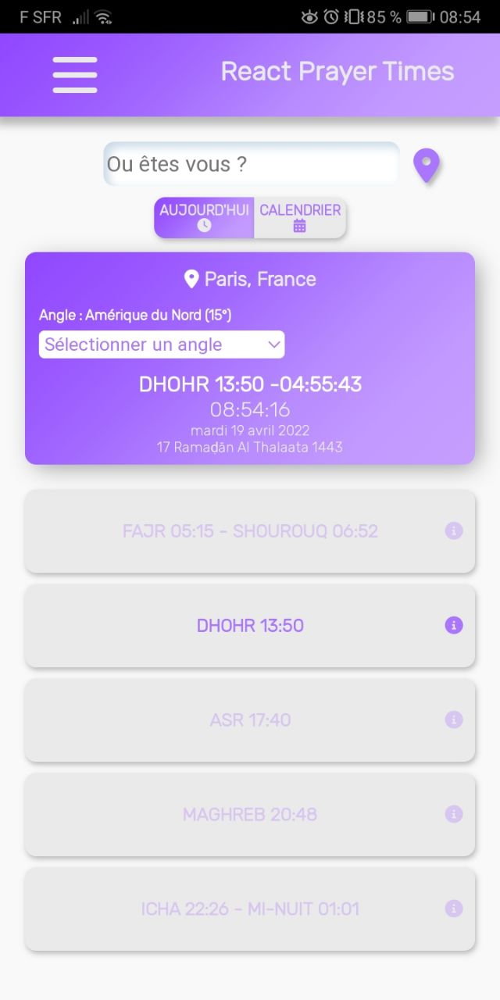
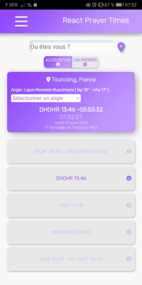
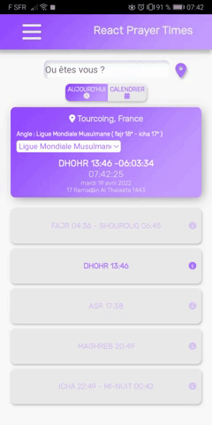

# React Prayer Times

Application web progressive d'horaires de prières développer avec React JS, utilisation des Service Worker, Web Worker, et plusieurs API.

## Fonctionalités

- Mode hors ligne

- Instalation

- Localisation

- Recherche par ville et par pays

- Avoir les horaires du mois

- Lecture du Coran et de la traduction française

