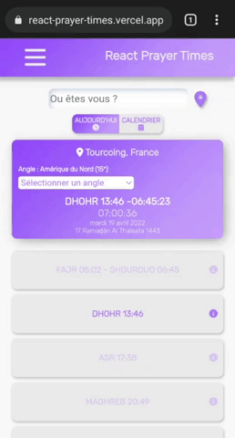

⚠️Archive ⚠️
# React Prayer Times 

Application web progressive d'horaires de prières développer avec React JS, utilisation des Service Worker, Web Worker, et plusieurs API.

## Table of content

- [Overview](#overview)
- [Fonctionnalités](#fonctionnalités)
    - [Mode hors ligne](#mode-hors-ligne)
    - [Installation mobile](#installation-mobile)
    - [Localisation](#localisation)
    - [Recherche par ville et par pays](#recherche-par-ville-et-par-pays)
    - [Avoir les horaires du mois](#avoir-les-horaires-du-mois)
    - [Lecture du coran](#lecture-du-coran-et-de-la-traduction-française)
- [Installation](#installation)


## Overview 
Voici comment se présente l'application : 
<br />
<br />


## Fonctionnalités


- ### Mode hors ligne


- ### Installation mobile



- ### Localisation


- ### Recherche par ville et par pays


- ### Avoir les horaires du mois


- ### Lecture du Coran et de la traduction française


## Installation

Cloner le projet, et lancer les scripts suivant : 

- ```npm install``` : Installer les dépendances utilisées dans le projet (A noté qu'il faut avoir NodeJs d'installer sur son ordinateur)
- ```npm start``` : Lancer l'exécution de l'application


> Fait par L.Hourquin
